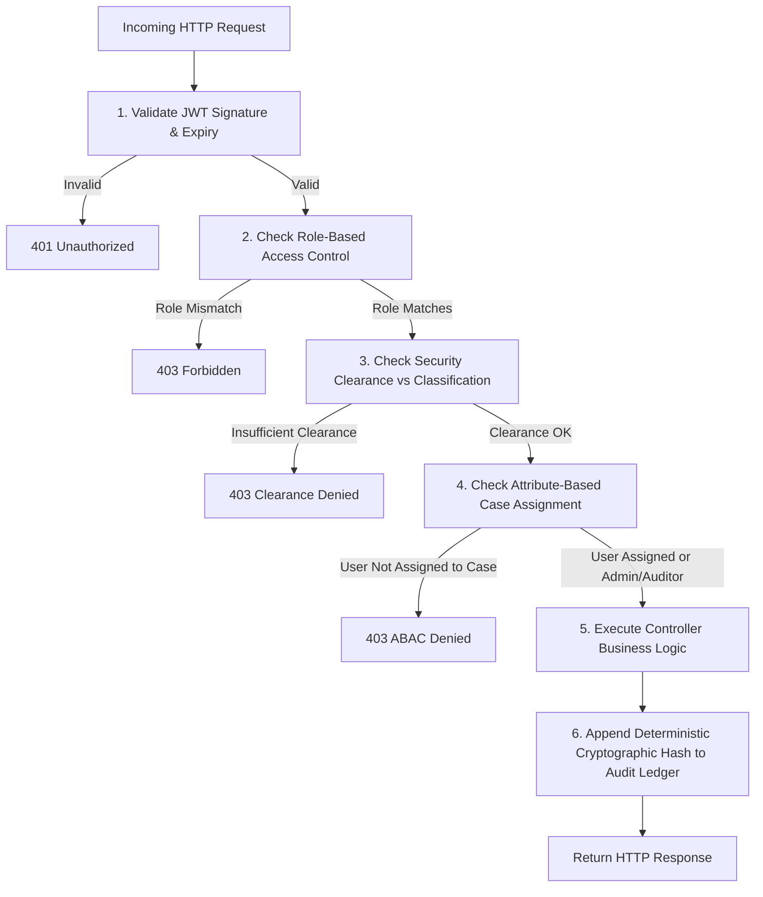
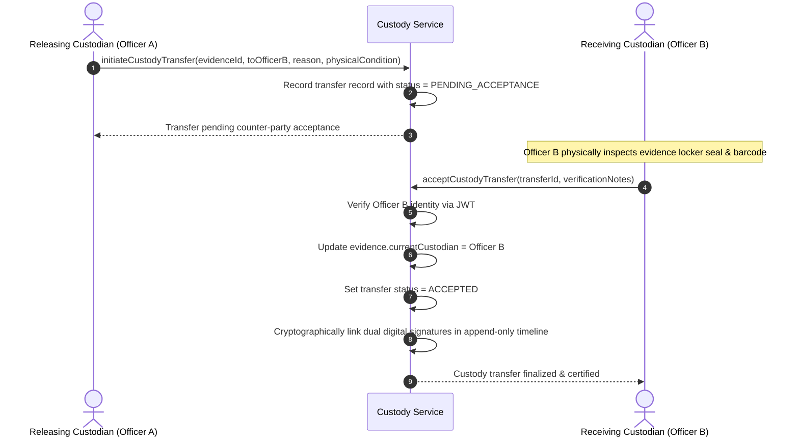

# System Architecture & Technical Specification

## Secure Digital Document Management System Architecture

---

## 1. High-Level Modular Monolith Architecture

The system is architected as a **modular monolith** to eliminate the operational latency, distributed transaction failure modes, and security perimeter leaks inherent to microservices, while maintaining strict architectural boundaries between security domains.

```text
                                  +---------------------------+
                                  |     React 18 Frontend     |
                                  |  (Role-Adaptive Console)  |
                                  +-------------+-------------+
                                                |
                                      HTTPS / REST / WSS
                                                |
                                  +-------------v-------------+
                                  |      Nginx Web Proxy      |
                                  |  (Security Headers / SSL) |
                                  +-------------+-------------+
                                                |
                   +----------------------------v----------------------------+
                   |               Spring Boot 3.4.3 Backend                 |
                   |                                                         |
                   |  [Security Filter Chain: Stateless JWT + CORS + CSRF]  |
                   |                             |                           |
                   |  [Zero-Trust Pipeline: RBAC + Case ABAC + Clearance]    |
                   |                             |                           |
                   |  +--------------------------+------------------------+  |
                   |  |                      Core Modules                 |  |
                   |  |  • Auth & User Management (MFA / TOTP / BCrypt)   |  |
                   |  |  • Case Dossier & State Machine Engine            |  |
                   |  |  • Encrypted Document Vault (AES-256-GCM / Tika)  |  |
                   |  |  • Physical Evidence & Barcode Engine             |  |
                   |  |  • Dual-Party Digital Chain of Custody Protocol   |  |
                   |  |  • RSA-2048 Digital Signature & Locking Service   |  |
                   |  |  • Cryptographic Hash-Chained Audit Ledger        |  |
                   |  |  • Prosecution & Section 65B Bundle Compiler      |  |
                   |  +--------------------------+------------------------+  |
                   +-----------------------------+---------------------------+
                                                 |
         +-------------------+-------------------+-------------------+-------------------+
         |                   |                   |                   |                   |
+--------v-------+  +--------v-------+  +--------v-------+  +--------v-------+  +--------v-------+
|   PostgreSQL   |  |  Redis 7 Cache |  | MinIO S3 Vault |  | ClamAV Daemon  |  | Elasticsearch  |
|  (22 Tables +  |  | (Rate Limiting |  |  (Encrypted    |  |  (Anti-Malware |  |   (Federated   |
|   Audit Chain) |  |   & Sessions)  |  |    Payloads)   |  |  Streaming)    |  |  Case Search)  |
+----------------+  +----------------+  +----------------+  +----------------+  +----------------+
```

---

## 2. Zero-Trust Request Pipeline

Every incoming HTTP request undergoes a multi-layer evaluation before reaching controller business logic:



### ABAC Evaluation Rules:
1. `ADMIN` and `AUDITOR` roles possess systemic oversight permissions and can read case metadata for system administration and compliance audits.
2. `INVESTIGATOR`, `FORENSIC_OFFICER`, and `PROSECUTOR` personas are evaluated dynamically against `case_user_assignment`. If an investigator is not explicitly assigned to the case, access is denied (HTTP 403).
3. The user's `SecurityClearance` must be greater than or equal to the case/document `DocumentClassification`:
   $$\text{UNCLASSIFIED} < \text{RESTRICTED} < \text{CONFIDENTIAL} < \text{SECRET} < \text{TOP\_SECRET}$$

---

## 3. Secure Document Upload & Ingestion Pipeline

When an evidentiary document or digital forensic report is uploaded, it passes through an uncompromising 5-step security gauntlet:

```text
[Client File Upload]
       │
       ▼
1. Apache Tika Magic Bytes Inspection
   ├─ Reads binary magic numbers (ignores spoofed file extensions)
   ├─ Rejects dangerous executables (application/x-msdownload, scripts, polyglots)
   └─ Validates against strict MIME whitelist (PDF, JPEG, PNG, DOCX, ZIP, TXT)
       │
       ▼
2. ClamAV Anti-Malware Streaming
   ├─ Streams binary stream directly over TCP socket to ClamAV daemon
   ├─ Evaluates EICAR signatures, trojans, ransomware, and macro exploits
   └─ Rejection halts pipeline immediately with 400 Bad Request
       │
       ▼
3. SHA-256 Integrity Hash Computation
   ├─ Computes standard 256-bit SHA-256 fingerprint on plaintext binary
   └─ Hash is permanently stored in database record for bit-rot / tamper detection
       │
       ▼
4. AES-256-GCM Envelope Encryption
   ├─ Generates cryptographically secure random 256-bit Data Encryption Key (DEK)
   ├─ Generates 96-bit Initialization Vector (IV)
   ├─ Encrypts payload with AES-GCM producing 128-bit authentication tag
   └─ Encrypts DEK using system Master Key (KEK); stores encrypted DEK + IV
       │
       ▼
5. MinIO S3 Vault Storage & Hash Ledger Recording
   ├─ Writes encrypted ciphertext to private MinIO S3 bucket (zero plaintext at rest)
   └─ Appends immutable record to Hash-Chained Audit Ledger
```

---

## 4. Dual-Party Chain of Custody Protocol

To ensure evidentiary non-repudiation in judicial court, evidence custody cannot be transferred unilaterally.



---

## 5. Cryptographic Hash-Chained Audit Ledger

Every security-sensitive event (case access, upload, custody transfer, status change, login failure) is permanently sealed into an append-only hash chain.

### Mathematical Specification:
For any entry $n$ in the audit log:

$$\text{Payload}_n = \text{sequenceNumber} \,\|\, \text{action} \,\|\, \text{resourceType} \,\|\, \text{resourceId} \,\|\, \text{username} \,\|\, \text{ipAddress} \,\|\, \text{timestampMs} \,\|\, \text{previousHash}$$

$$\text{CurrentHash}_n = \text{SHA-256}(\text{Payload}_n)$$

### Genesis Block:
$$\text{CurrentHash}_0 = \text{SHA-256}(\text{"0:GENESIS:SYSTEM:0:system:127.0.0.1:0:"} \,\|\, \text{"0"}^{64})$$

### Deterministic Tamper Detection:
When `/api/v1/audit/ledger/verify` is invoked, the engine walks from sequence index $0$ to $N$:
1. Reconstructs $\text{Payload}_k$ using stored database fields and $\text{timestampMs}$.
2. Re-computes $\text{CalculatedHash}_k = \text{SHA-256}(\text{Payload}_k)$.
3. If $\text{CalculatedHash}_k \ne \text{StoredHash}_k$, an alert is raised identifying the exact corrupted row.
4. If $\text{StoredPreviousHash}_k \ne \text{StoredHash}_{k-1}$, chain discontinuity is flagged.

---

## 6. Case Workflow State Machine

Case lifecycles strictly enforce statutory procedural law:

```text
[REGISTERED]
     │
     ▼
[UNDER_INVESTIGATION] ──(Legal Hold may be imposed at any time)──
     │
     ▼
[CHARGESHEET_FILED]
     │
     ▼
[IN_TRIAL]
     │
     ▼
[CLOSED]
     │
     ▼
[ARCHIVED]
```

- Any attempt to jump from `REGISTERED` directly to `CLOSED` or `IN_TRIAL` is rejected by the domain validator.
- Cases under an active **Legal Hold** cannot be marked as `CLOSED` or `ARCHIVED`.
